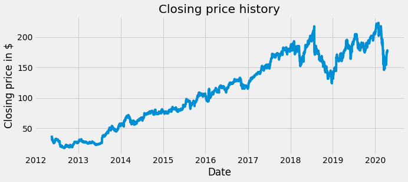
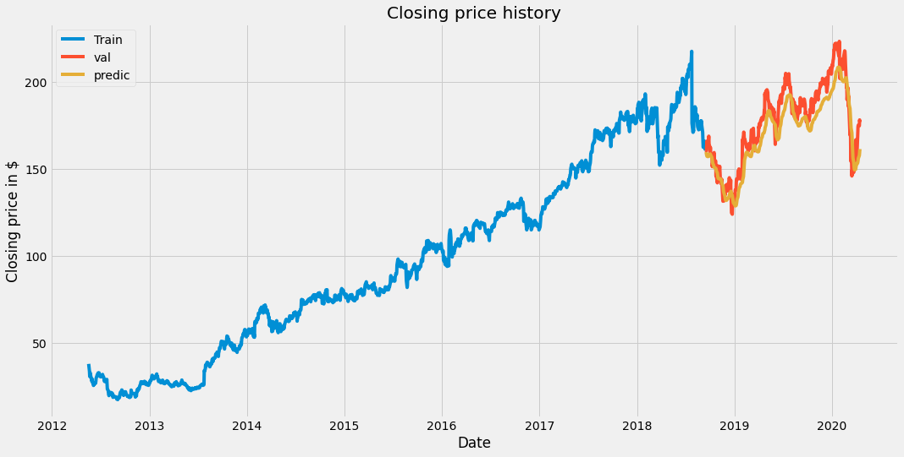

```python
import math
import pandas_datareader as web
import numpy as np 
from sklearn.preprocessing import MinMaxScaler
from sklearn.model_selection import train_test_split
import quandl
from keras.models import Sequential 
from keras.layers import Dense, LSTM
import matplotlib.pyplot as plt
```

    Using TensorFlow backend.


```python
df = web.DataReader('FB', data_source='yahoo', start='2012-01-01', end='2020-04-15')
df.head()
```


<div>
<style scoped>
    .dataframe tbody tr th:only-of-type {
        vertical-align: middle;
    }

    .dataframe tbody tr th {
        vertical-align: top;
    }

    .dataframe thead th {
        text-align: right;
    }
</style>
<table border="1" class="dataframe">
  <thead>
    <tr style="text-align: right;">
      <th></th>
      <th>High</th>
      <th>Low</th>
      <th>Open</th>
      <th>Close</th>
      <th>Volume</th>
      <th>Adj Close</th>
    </tr>
    <tr>
      <th>Date</th>
      <th></th>
      <th></th>
      <th></th>
      <th></th>
      <th></th>
      <th></th>
    </tr>
  </thead>
  <tbody>
    <tr>
      <th>2012-05-18</th>
      <td>45.000000</td>
      <td>38.000000</td>
      <td>42.049999</td>
      <td>38.230000</td>
      <td>573576400</td>
      <td>38.230000</td>
    </tr>
    <tr>
      <th>2012-05-21</th>
      <td>36.660000</td>
      <td>33.000000</td>
      <td>36.529999</td>
      <td>34.029999</td>
      <td>168192700</td>
      <td>34.029999</td>
    </tr>
    <tr>
      <th>2012-05-22</th>
      <td>33.590000</td>
      <td>30.940001</td>
      <td>32.610001</td>
      <td>31.000000</td>
      <td>101786600</td>
      <td>31.000000</td>
    </tr>
    <tr>
      <th>2012-05-23</th>
      <td>32.500000</td>
      <td>31.360001</td>
      <td>31.370001</td>
      <td>32.000000</td>
      <td>73600000</td>
      <td>32.000000</td>
    </tr>
    <tr>
      <th>2012-05-24</th>
      <td>33.209999</td>
      <td>31.770000</td>
      <td>32.950001</td>
      <td>33.029999</td>
      <td>50237200</td>
      <td>33.029999</td>
    </tr>
  </tbody>
</table>
</div>


```python
df.shape
```


    (1989, 6)


```python
plt.style.use("fivethirtyeight")
plt.figure(figsize=(10,4))
plt.title('Closing price history')
plt.plot(df['Close'])
plt.xlabel("Date")
plt.ylabel("Closing price in $")
plt.show()
```





```python
data = df.filter(['Close'])
dataset = data.values
training_data_len = math.ceil(len(dataset)*0.8)
scaler = MinMaxScaler(feature_range=(0,1))
scaled_data = scaler.fit_transform(dataset)
train_data = scaled_data[0:training_data_len, :]

X_train = []
y_train = []

for i in range(60, len(train_data)):
    X_train.append(train_data[i-60:i,0])
    y_train.append(train_data[i,0])
    
X_train, y_train = np.array(X_train), np.array(y_train)
X_train = np.reshape(X_train, (X_train.shape[0], X_train.shape[1], 1))
X_train.shape
```


    (1532, 60, 1)


```python
model = Sequential()
model.add(LSTM(50, return_sequences=True, input_shape = (X_train.shape[1], 1)))
model.add(LSTM(50, return_sequences=False))
model.add(Dense(25))
model.add(Dense(1))
model.compile(optimizer= 'adam', loss= 'mean_squared_error')
model.fit(X_train, y_train, batch_size=1, epochs=1)
```

    Epoch 1/1
    1532/1532 [==============================] - 131s 85ms/step - loss: 0.0019


    <keras.callbacks.callbacks.History at 0x7f9697700bd0>


```python
test_data = scaled_data[training_data_len - 60: , :]

X_test = []
y_test = dataset[training_data_len:, :]

for i in range(60, len(test_data)):
    X_test.append(test_data[i-60:i, 0])

X_test = np.array(X_test)
X_test = np.reshape(X_test, (X_test.shape[0],X_test.shape[1],1))
```


```python
predictions = model.predict(X_test)
predictions = scaler.inverse_transform(predictions)
```


```python
rmse = np.sqrt(np.mean(predictions - y_test)**2)
rmse
```


    7.330208804805573


```python
train = data[:training_data_len]
valid = data[training_data_len:]
valid['Predictions'] = predictions

```

    /Users/azakeres/Library/Python/3.7/lib/python/site-packages/ipykernel_launcher.py:3: SettingWithCopyWarning: 
    A value is trying to be set on a copy of a slice from a DataFrame.
    Try using .loc[row_indexer,col_indexer] = value instead
    
    See the caveats in the documentation: http://pandas.pydata.org/pandas-docs/stable/user_guide/indexing.html#returning-a-view-versus-a-copy
      This is separate from the ipykernel package so we can avoid doing imports until


```python
plt.figure(figsize=(16,8))
plt.title('Closing price history')
plt.plot(train['Close'])
plt.plot(valid[["Close","Predictions"]])
plt.xlabel("Date")
plt.ylabel("Closing price in $")
plt.legend(['Train', 'val', 'predic'])
plt.show()
```





```python

```
